# 2주차(20220315)
-안드로이드 스튜디오 설치 &&깃허브 가입 및 저장소 생성
-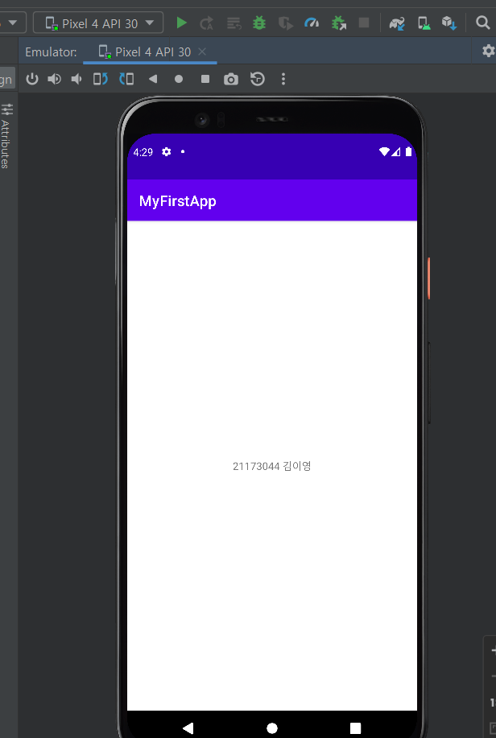</img>

## 3주차(20220322)

-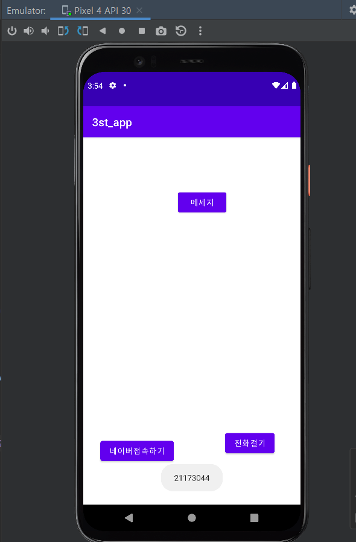</img>
-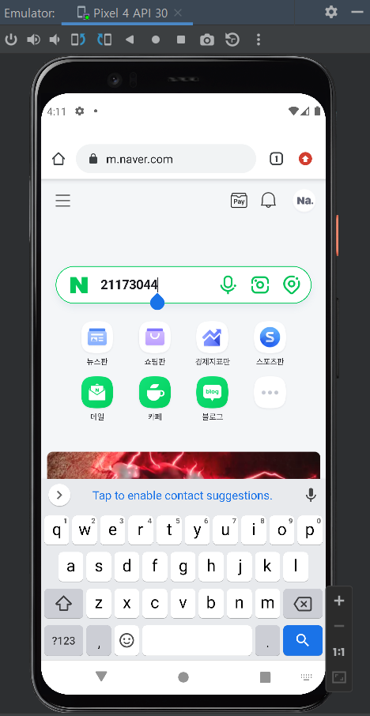</img>
-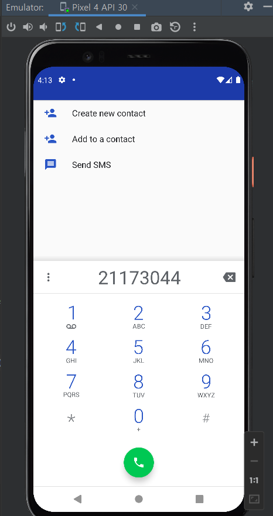</img>

# 5주차(20220405)
-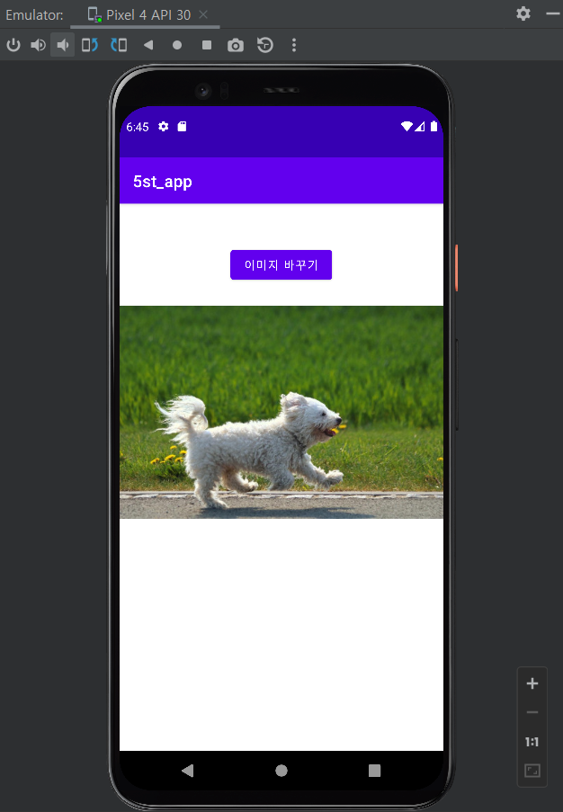</img>
-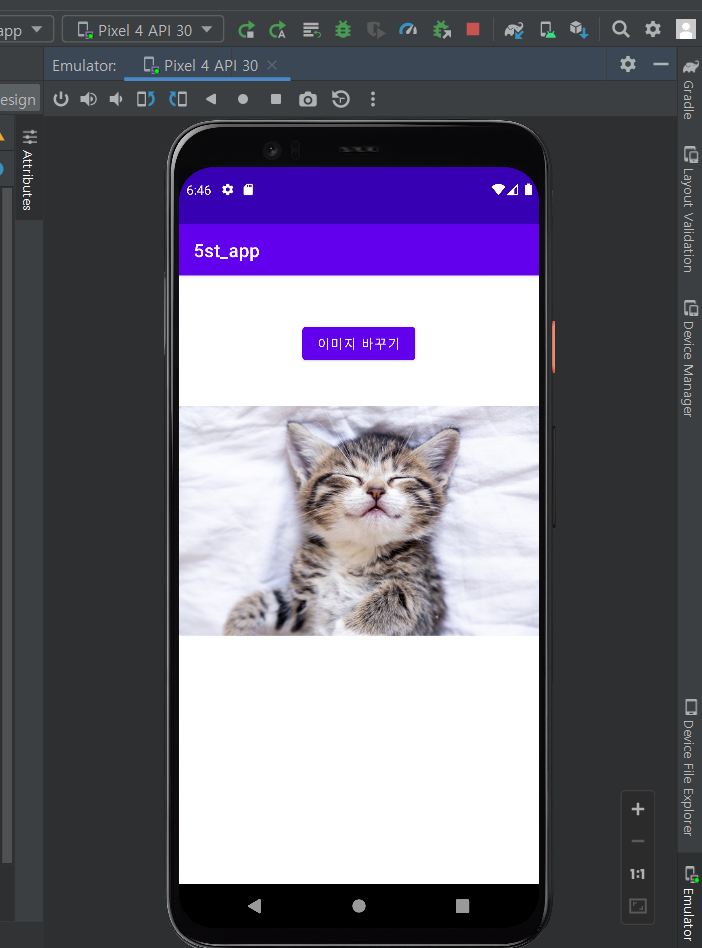</img>
-</img>
-</img>

# 6주차(20220415)
-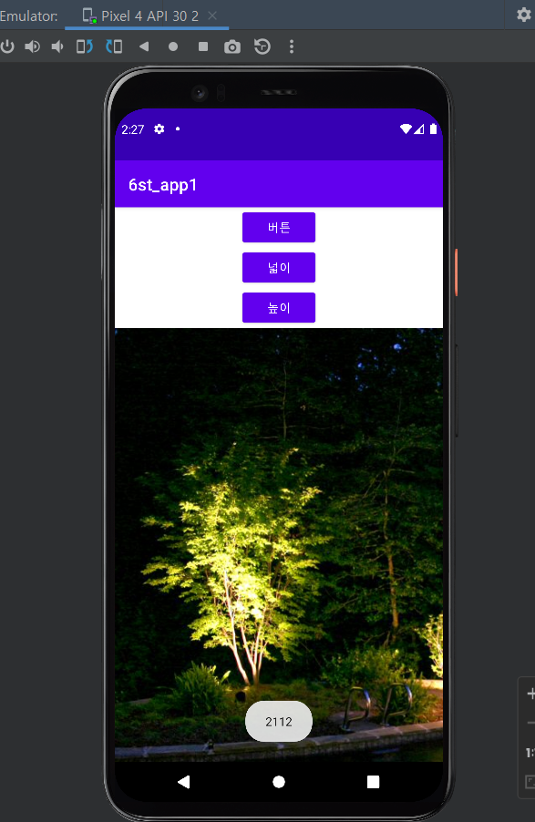</img>
-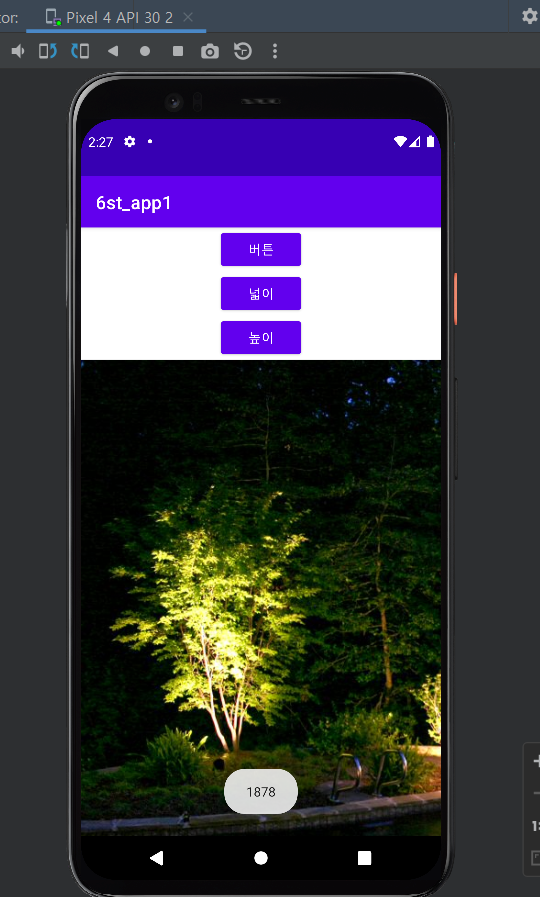</img>

# 10주차(20220510)
-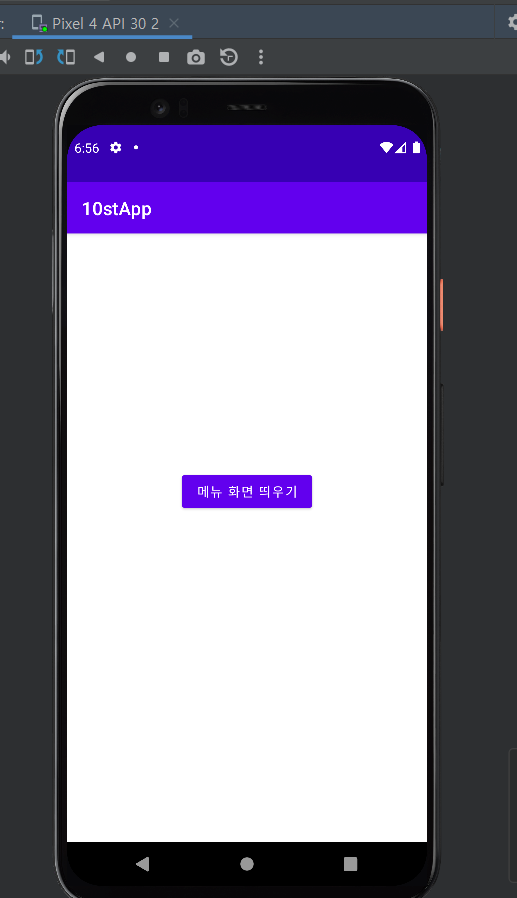</img>
-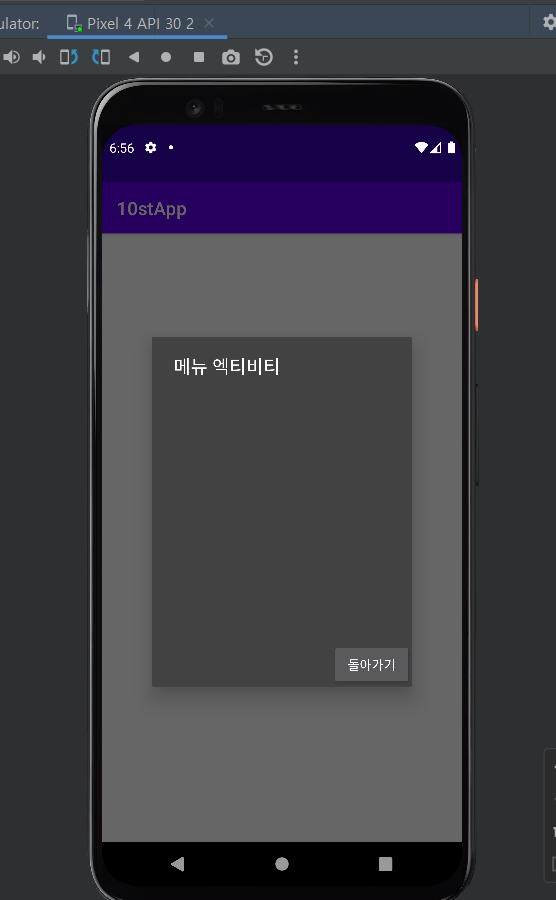</img>
-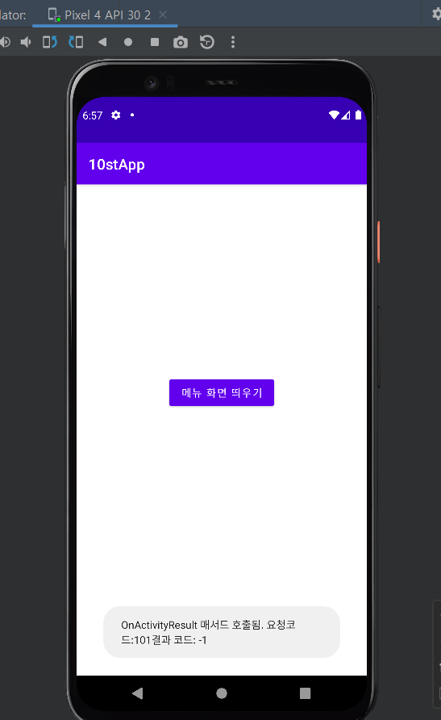</img>
-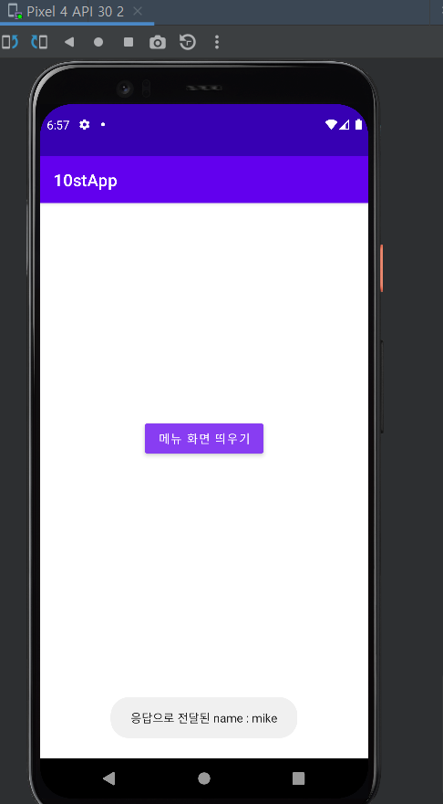</img>
